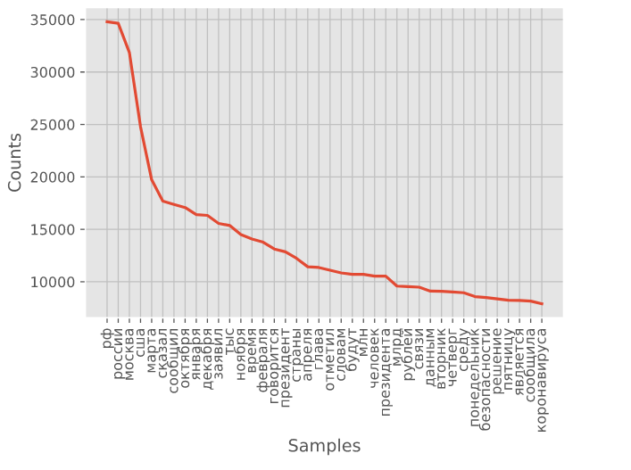
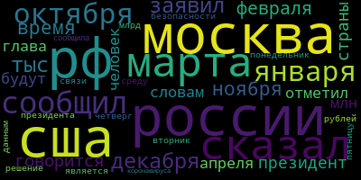

# Tass-Data-Processing

Processing the data from "Tass" (Russian News Agency). The links are: https://tass.ru/ and https://tass.com/.

This repo will help You to understand how to extract, load, transform, analyze and visualize information from the "Tass".

# What is this?

This is a personal project to practice in data processing.

# What are the parts of this data-processing repo?

### Web scraping:

Extracting.py contains ways to get info from the 'https://tass.ru/' (e.g. 'article_text', 'title', 'category', 'href') by the start date and the end date ('2020-04-21 00:00:00', '2020-04-20 00:00:00').
That parsed information is stored in '/data/' folder as (one_month) '*.pickle' files.

### ETL:

Cleaning.py contains ways to extract, transform and load an important data to the dataframe.

### Analyzing and visualizing:

Analyzing.ipynb contains ways to show some basic info about the dataframe.
The information is stored in '/output_images/' folder.

# Results:

The results are stored as 'final_info.html' and 'full_info.html' in '/output_images/' folder.

There is a selection of days: from the beginning of October 2019 to mid-April 2020.
Each day consists of a different number of articles.
Each cell contains a piece of information about one article.
Each day has its own color, depending on number of articles per day:

There is the same selection of days. But the colors correspond to the field called 'covid_related'.
If the cell is indeed covid_related, the cell is highlighted in red:

These are not just a static images, You can open html files in Your browser without any problem.
This repo can be downloaded as zip-archive and You don't need to have Python installed on Your computer.

output_images/full_info.html:

As You can see from 'full_info.html': the days highlighted in blue are weekends and holidays, on such days there is much less news.

output_images/final_info.html:

The 'final_info.html' file shows that COVID has only been gaining attention in Russia since mid-January 2020:

By mid-March, COVID-related news exceeded half of all articles per day:

The most common words from articles:

It is possible to make a Wordcloud by these common words. The size of each word corresponds to its frequency:

For more info check out 'analyzing.ipynb'.

# Results (the same explanation but it is written in Russian):

Результатом проекта являются файлы final_info.html и full_info.html из папки output_images.

Выше представлены выборки дней: с начала октября 2019 года до середины апреля 2020 года.
Каждый день состоит из некоторого количества статей.
Каждая ячейка содержит информацию об одной статье. 
Каждый день подсвечен в зависимости от количества статей за этот день.

На другом отображении представлена та же выборка. Красным подсвечены ячейки, в которых упоминается COVID.

Как видно из full_info.html: выделенные темно-синим цветом дни - это выходные и праздники, в такие дни новостей заметно меньше.

Отображение final_info.html наглядно демонстрирует, что общее внимание в новостях COVID привлек к себе только с середины января 2020 года. А в середине марта связанных с COVID новостей было больше половины от всех новостей за день.

Репозиторий можно скачать zip архивом и самостоятельно открыть файлы из папки output_images в браузере, для этого не надо ничего устанавливать.

Кроме этого, представлены: график самых частых слов и облако из этих слов.

Для более подробной информации можно скачать/посмотреть 'analyzing.ipynb'.

# What is the reason for this research?

Initially (April 2020), I wanted to try a new at that time jupyter notebook in VS Code.

So, I chose the direction of data mining:

- Mentions in TASS about COVID-19 (so-called citizens' awareness)

By the beginning of May 2020, many countries were under a lockdown, so, one way or another, everyone was aware of COVID-19.

The results of this research provide a visual answer about mentions in TASS about COVID-19 in Russia.

This repo contains downloaded data, supplemented by primary processing with basic analysis of article texts for the time: from the beginning of October 2019 to mid-April 2020.

# The exact same initial reasons but written in Russian:

Изначально (апрель 2020) я хотел попробовать новый на тот момент jupyter notebook в VS Code.

Было выбрано направление для извлечения данных:

- Упоминания в ТАСС о COVID-19 (т.н. осведомленность граждан)

К началу мая 2020 многие страны ввели тотальный локдаун, так что, так или иначе, все были осведомлены о COVID-19.

Результаты этого проекта демонстрируют, как проявлялись упоминания о COVID-19 в ТАСС в России.

Репозиторий содержит скачанные данные, дополненные первичной обработкой и базовым анализом текстов статей за время: с начала октября 2019 года до середины апреля 2020 года.

## Rate this project! :star:
### If you liked this repo, give it a star. Thanks!

